# Hello! 👋 I'm Dakotah Davis

**Cybersecurity professional dedicated to protecting people, systems, and data.** I have hands‑on experience defending Microsoft 365 environments, investigating phishing and account‑compromise incidents, and implementing security controls based on NIST standards. My goal is to help organizations build resilient infrastructure and foster a culture of security awareness.

## What drives me
- **Passionate about cybersecurity and risk management:** analyzing threats, containing incidents, and communicating risk to leadership.
- **Interested in identity & access management, incident response, endpoint hardening, and network/firewall security.**
- **Actively expanding my expertise** in firewall administration, security monitoring, and compliance frameworks including NIST SP 800‑171 and CMMC.
- **Collaboration and mentorship:** I enjoy working with teams to implement security best practices and empower others through documentation and training.

## Certifications

I hold a number of industry certifications that demonstrate my commitment to continuous learning and professional development:

- **CompTIA A+**
- **CompTIA Network+**
- **CompTIA Security+**
- **CompTIA CySA+**
- **CompTIA PenTest+**
- **CompTIA Project+**
- **CompTIA IT Operations Specialist (CIOS)**
- **CompTIA Secure Infrastructure Specialist (CSIS)**
- **CompTIA Security Analytics Professional (CSAP)**
- **CompTIA Network Vulnerability Assessment Professional (CNVP)**
- **CompTIA Network Security Professional (CNSP)**
- **ISC2 Associate (towards SSCP)**
- **ITIL Foundation Certification in IT Service Management**
- **Leadership Certification – National Society of Leadership and Success**

## Certification images

Below are thumbnails of my certifications stored in this repository’s `images/` folder. Click any image to view it in full resolution:

| Certification | Image |
|---|---|
| CompTIA PenTest+ | 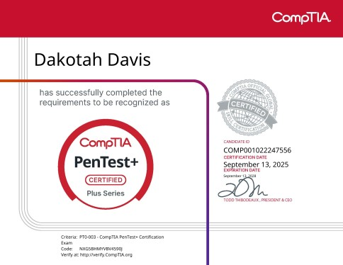 |
| CompTIA CySA+ | 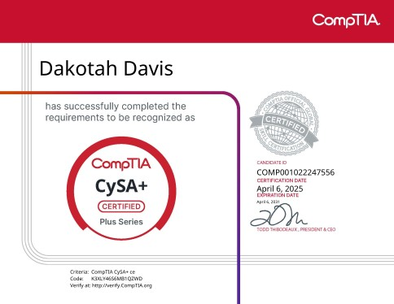 |
| CompTIA Project+ | 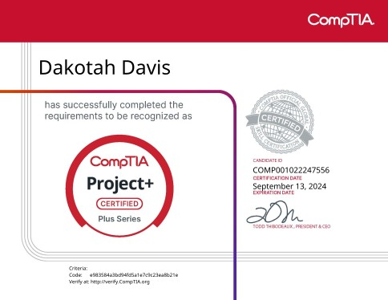 |
| CompTIA Security+ | 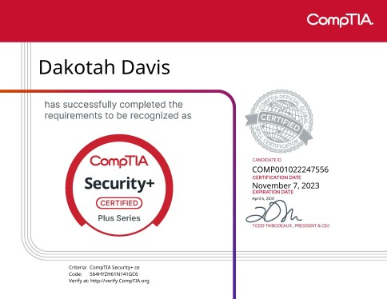 |
| CompTIA Network+ |  |
| CompTIA A+ | 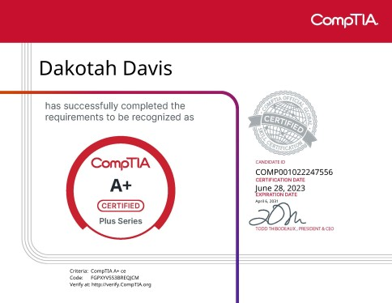 |
| CompTIA IT Operations Specialist (CIOS) | 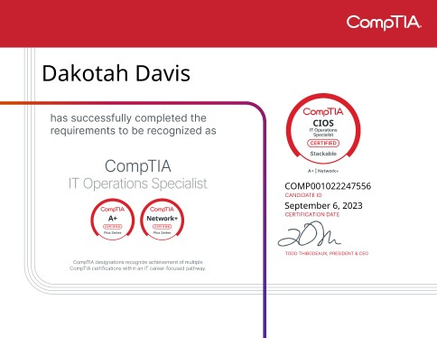 |
| CompTIA Secure Infrastructure Specialist (CSIS) | 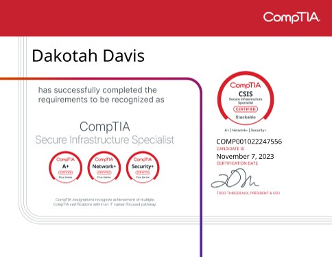 |
| CompTIA Security Analytics Professional (CSAP) | 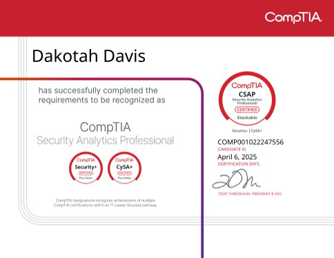 |
| CompTIA Network Vulnerability Assessment Professional (CNVP) | 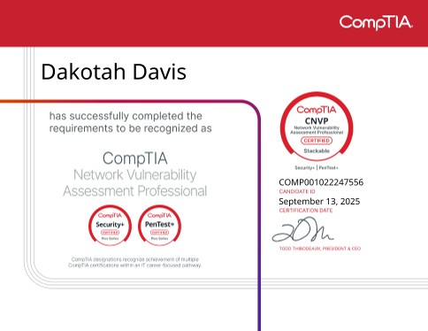 |
| CompTIA Network Security Professional (CNSP) | 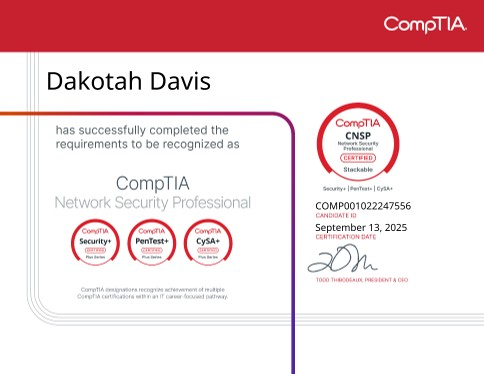 |
| ISC2 SSCP (Associate) | 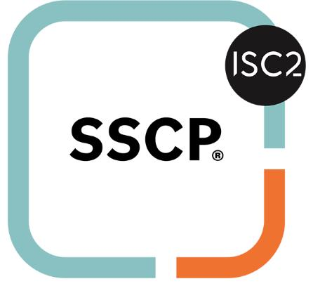 |
| Leadership Certificate | 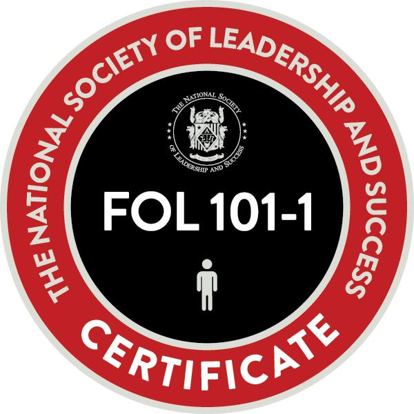 |
| ITIL Foundation Certification in IT Service Management |  |

## Education

- **Bachelor of Science in Cybersecurity and Information Assurance** – Western Governors University (2025)
- **Associate of Arts in University Studies – Humanities** – Palomar College (2022)
- **Associate of Arts in General Studies – Arts and Humanities** – Palomar College (2022)

---

Thanks for visiting my profile! I'm always eager to connect with other cybersecurity professionals and enthusiasts. Feel free to explore my repositories (coming soon) and connect with me on LinkedIn.
